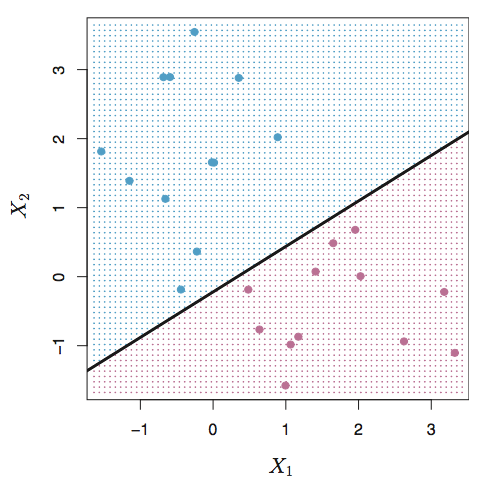
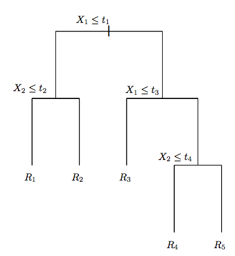
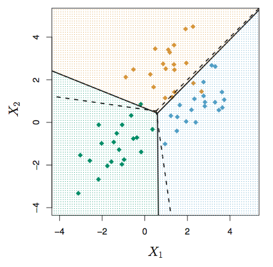

---
header-includes:
- \usepackage{amssymb,amsthm,amsmath}
- \usepackage{chemarr}
output: pdf_document

---

<!--
You can delete the header-includes (lines 3-5 above) if you like and also the chunk below since it is loaded in the skeleton.Rmd file.  They are included so that chap2.Rmd will compile by itself when you hit Knit PDF.
-->

# Theoretical Background {#the-background}

Broadly speaking, there are two types of machine learning techniques: supervised, and unsupervised methods. In a supervised setting, inputs are mapped to a predefined label, and models are trained to predict labels for a new set of inputs. In the case of text classification, each response and associated category are learned by a classifier which then predicts labels for new responses. In an unsuerpvised setting, there is no corresponding labels to the inputs. These methods cluster response based on associations between responses. Given that this study aims to compare the performance of classifiers when labeling texts, we remain in a supervised setting.

The objective is to minimize the classification error rate. The classification error rate is defined as the proportion of training observations in the region that do not belong to the most common class.

## SVM:
The SVM approach to classification is a generalization of the maximal margin classifier to non-linear decision boundaries. It is first defined by a hyperplane, which is a flat subspace existing in a $p-1$ dimensional setting. The mathematical definition of a hyperplanes is a line with: $$\beta_0+\beta_1X_1+\beta_2X_2+...+\beta_pX_p=0$$
	
The hyperplane essentially divides a p-dimensional space into two halves depending on whether or not the linear equation is greater than zero or less than zero for a given $X=(X_1,X_2,...,X_p)^T$. In the scenario where $X$ is an $n * p$ matrix whwere observations fall into two classes $y_1,y_2,...y_n$ between ${-1,1}$. If a separating hyperlane exists, it can be used to construst an intuitive classifier based on the $G(x) = sign[x_i^T\beta+\beta_0]$. The optimization problem $$max M$$ subject to $$y_i(x_i^T\beta+\beta_0) \ge M, i = 1, ...,N$$ Where M is the width of the margin. 

In a high dimensional setting however, this is unlikely to be the case. A soft margin classifier aims to address this by allowing some observations to follow on the wrong side of the margin or even hyperplane. These observations correspond to training points that have been misclassified by the support vector classifier. This constraint can now be modified to be: $$y_i(x_i^T\beta+\beta_0) \ge M - \xi$$.

Where $\xi$ is a slack variable representing observations on the wrong side of the margin/hyperplane. In this setting, points on the wrong side of the margin are penalized proportionally to the distance from the boundary. 

Tuning parameter, C can be introduced restrain the number of points that violate the hyperplane. As C increases we allow for more observations to appear on the wrong side of the hyperplane so the margin widens. Conversely, as C decreases less violations result in a smaller margin. Increasing the cost parameter additionally makes models more expensive and increases the risk of losing model generability.

In situations where there are more than k > 2 classes, k SVMs are fit and compared to the remaining k-1 classes. Observations are assigned to a class based on which $\beta_0k+\beta_{1k}X_{1k}+...+\beta_{pk}X_{pk}$ is the greatest (Hastie, 337-356).

SVMs hold a unique property in that they can classify observations independent of the dimensionality of the feature space (Joachim). By separating the data on the largest margin rather than the number of features, our model can be easily generalized, irrespective of the size of the feature space.
	
	
The issue of non-linearity is typically addressed by enlarging the feature space by using higher order polynomial functions of the predictors.

## Decision Trees

Decision trees partition a feature space into a number of simpler regions. Decision trees are composed of two main parts: a node and leaf. Each node in a decision tree represents a variable by which observations can be group based on conditions associated with that variable. In our setting, every node is a dtm feature. In a classification setting, the tree is split based on which variable minimizes the classification error rate. If we let $\hat{p}_{mk}=1/N_m*\Sigma I(y_i = k)$ be the proportion of class k observations in node m, observsations are classified to the class where $k(m)=_{argmax} \hat{p}_{mk}$ (Hastie, 312). This can also be described as the majority class for node m.  This greedy algorithm chooses which variable to split on based on the largest drop in misclassification rate.

One benefit of decision trees are their interpretability. However do to their high variance, resulting trees can vary greatly if the training data is modified, and can lead to drastically different test labels. Traditionally, classification and regression decision trees are associated with high variance and low bias.

## Bagging

Bootstrap aggregation (bagging) is an ensemble method that combines the predictions of several smaller algorithms to make an improve estimate. Given a set of independent observations $X_1...X_n$ each with variance $\sigma^2$, the variance of the mean $\bar{X}$ is $\frac{\sigma^2}{n}$. This illustrates how averaging over a set of observations can reduce variance. In this approach, several samples are taken from the training data with replacement and a classification tree is trained on each. Given a new data set, the bagging method aggregates the average prediction across the models for each observation and assigns it to the class with the majority vote (Hastie, 317).

Because the prediction is an average of serval trees, we are less concerned with one tree overfitting. This allows for trees to remain unpruned, with high variance. In this setting the only adjustable parameter is the number of samples drawn, in essence, how many decision trees are averaged. Traditionally, this number is choose through cross-validation (increased until accuracy stops showing improvement). It must be kept in consideration however that more samples will require more time to train the models, and may be computational infeasible.

Due to the algorithms greedy nature, a series of decision trees may have highly correlated predictions as a result of the method dividing the data based on the largest drop in missclassification rate. Imagine a scenario where there is only one strongly correlated predictor. Even with a high number of samples, we can expect most trees generated to split the first node on this variable. Situations where there is structural similarity between bootstrap samples can lead to predictions that are highly correlated. 

## Random Forests
Random Forests (rf) algorithms improve on the bootstrap aggregation by decorrelating trees. The main differences is that in a rf setting, only a random sample of m predictors from p variables can be chosen as a splitting feature. The alleviates the issue described earlier by not considering the one strong predictor in approximately $(p-m)/p$ of the splits. Situations where m = p is simply a bootstrap aggregation (Hastie, 319). Smaller values of m are traditionally helpful when there is a large number of correlated features.

## Linear Discriminant Analysis

LDA is most commonly used as a dimension reduction technique. In the case of  $p > 1$ classes, each class density is assumed to follow a multivariate Gaussian distribution $N(\mu_k, \Sigma)$, where $\mu_k$ is a class mean vector , and $\Sigma$ is common covariance matrix.

$$log(Pr(G=k|X=x)/Pr(G=l|X=x) =$$ $$log (f_k(x)/f_l(x)+log(\pi_k/\pi_l)$$ $$log(\pi_k/\pi_l) - 1/2(\mu_k+\mu_l)^T\Sigma^{-1}(\mu_k-\mu_l)+x^T\Sigma^{-1}(\mu_k-\mu_l)$$
When simplified further, the above becomes: $$\delta_k(x)=x^T\Sigma^{-1}\mu_k-1/2\mu_k^T\Sigma^{-1}+log\pi_k $$ This equation assigns an observation to the class for which the its $\delta_k(x)$ is the largest (Hastie, 143). Since the parameters of the gaussian are unknown, following estimates are used:

 $\hat{\pi}_k = N_k/N$ where $N_k$ is the number of class-$k$ observations
 
 $\hat{\mu}_k = \Sigma_{g=k}x_i/N_k$
 
 $\hat{\Sigma}_k =\Sigma_{k=1}^K$ $_k(x_i-\hat{\mu}_k(x_i-\hat{\mu}_k)^T/(N-K)$
	
	
As you can see the LDA decision rule depends on x only through a linear combination of its elements. One drawback however of the LDA is the restrictive conditions associated with the algorithm. LDA assumes that features within the data set are a series of independent multivariate gaussians with identical covariance matrices. Additionally, LDA requires the number of features to be less than the sample size. As p approaches n, the performance of the model declines. If the assumption of uniform variance is highly off, then LDA can suffer high bias (Hastie, 153). It will be interesting to see how these violations play out in a high dimensional, sparse setting.
	
	
